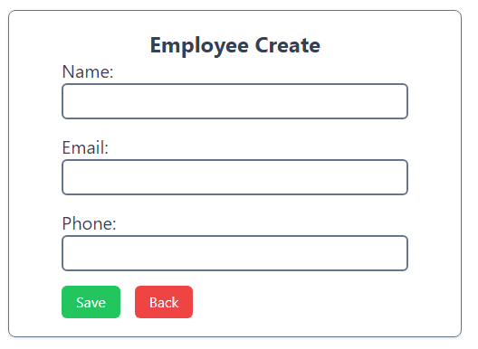
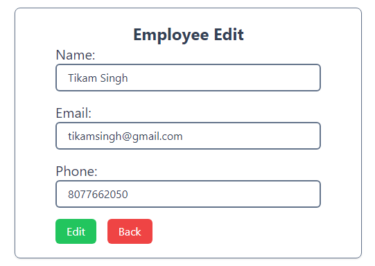
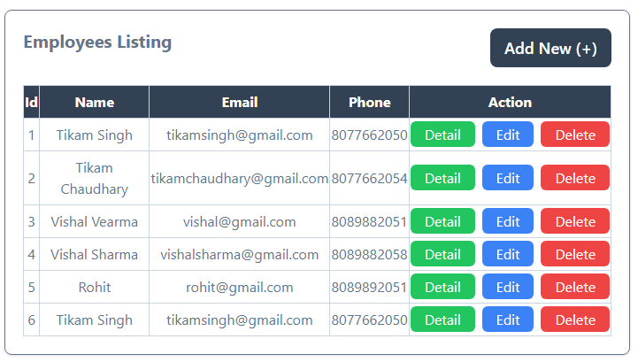

# 🌟React.js CRUD App With json-sverver
---
## Screenshots Of UI

---
## Quick start

### Step:1
> **1. Clone this repository:**
> - **`git clone https://github.com/tikamsingh172/react-crud_json-server.git`**
>
> **2. Install dependencies:** _In the project directory, you run:_
> - **`npm install`**

### Step:2 Start the json-server
> **In the project directory, you run:**
> - **`npx json-server db.json --port 8080`**

### Step:3 Run the react app
> **In the project directory, you run:**
> - **`npm run dev`**

---
## Detailed Decription about this app
**This is a quick example app for CRUD oprations in react.js with json-server (Fack API).**

**In this app, I use :-**
- `vite+react`
- `react-router-dom`
- `tailwindcss`
- `json-server`
